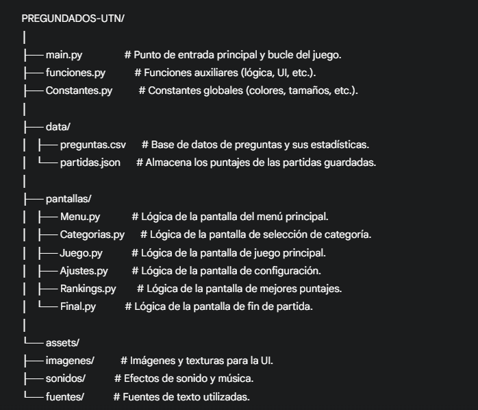

# Preguntados UTN - Versión Pygame

![Preguntados]

Este proyecto es una versión de escritorio del popular juego de trivia "Preguntados", desarrollado en Python con la biblioteca `pygame`. Fue creado como parte del segundo parcial de la materia **Programación I** en la **Tecnicatura Universitaria en Programación** de la Universidad Tecnológica Nacional (UTN), Facultad Regional Avellaneda.

## 📜 Descripción

El juego pone a prueba los conocimientos del jugador a través de preguntas de distintas categorías. El objetivo es acumular la mayor cantidad de puntos posible respondiendo correctamente, gestionando un número limitado de vidas y utilizando comodines de forma estratégica antes de que se acabe el tiempo.

## ✨ Características Principales

* **Juego de Trivia Clásico**: Responde preguntas de múltiples categorías (Arte, Historia, Cultura Nerd, etc.).
* **Interfaz Gráfica con Pygame**: El juego está desarrollado completamente con `pygame`, ofreciendo una experiencia visual e interactiva.
* **Selección de Categoría**: Antes de comenzar, un "dado" animado elige al azar la categoría de la partida.
* **Sistema de Vidas y Puntuación**:
    * Suma puntos por cada respuesta correcta.
    * Resta puntos y una vida por cada respuesta incorrecta.
    * Gana una vida extra y segundos de bonificación al acertar 5 preguntas seguidas.
* **Comodines Estratégicos**: Cada comodín se puede usar una sola vez por partida:
    * 💣 **Bomba**: Elimina dos de las respuestas incorrectas.
    * ✖️ **X2**: Duplica los puntos obtenidos en la siguiente respuesta correcta.
    * 🔄 **Doble Chance**: Permite un segundo intento si fallas la pregunta.
    * ⏭️ **Pasar**: Avanza a la siguiente pregunta sin afectar puntos ni vidas.
* **Ranking de Jugadores**:
    * Al finalizar una partida, puedes guardar tu nombre y puntaje.
    * El juego muestra un **Top 10** de los mejores puntajes históricos.
* **Configuración de Sonido**: Ajusta el volumen de la música o silénciala desde el menú de ajustes.
* **Estadísticas por Pregunta**: El juego registra la cantidad de aciertos, fallos y veces que cada pregunta fue formulada, guardando estos datos para futuras partidas.

## 🚀 Cómo Jugar

### Requisitos

* Python 3.x
* Biblioteca Pygame

### Instalación

1.  **Clona el repositorio:**
    ```bash
    git clone [https://github.com/tu-usuario/preguntados-utn.git](https://github.com/tu-usuario/preguntados-utn.git)
    ```
2.  **Navega al directorio del proyecto:**
    ```bash
    cd preguntados-utn
    ```
3.  **Instala Pygame:**
    ```bash
    pip install pygame
    ```
4.  **Ejecuta el juego:**
    ```bash
    python main.py
    ```

### Controles

* **Mouse**: Utiliza el puntero para hacer clic en los botones del menú, las respuestas y los comodines.
* **Teclado**: Ingresa tu nombre en la pantalla de fin de partida.

## 📂 Estructura del Proyecto

El código está organizado de manera modular para facilitar su lectura y mantenimiento:



## 🛠️ Tecnologías Utilizadas

* **Lenguaje**: Python
* **Biblioteca Principal**: Pygame (para la interfaz gráfica, eventos y sonido)
* **Formato de Datos**:
    * CSV para la base de datos de preguntas.
    * JSON para el guardado de partidas.

## 📄 Consigna Original

Este proyecto fue desarrollado siguiendo las pautas del [Segundo Parcial Programacion (PDF)](https://github.com/Gastonidas/PREGUNDADOS-UTN/blob/9ef893fd8f0641d1fec003b9d53acddf0316271e/Segundo%20parcial%20Programacio%CC%81n%201%20AD.pdf)
